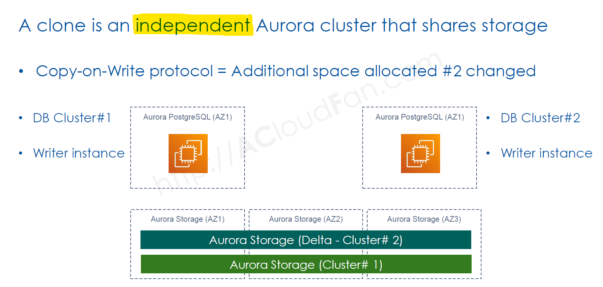

# 🌎 **Amazon Aurora: Unique Features & Innovations**

Amazon Aurora is **more than just a managed relational database**—it introduces **cloud-native innovations** that significantly enhance **performance, scalability, and reliability**. This guide dives into **Aurora’s unique features**, including **Global Databases, Serverless, Cloning, Cluster Cache Management, and Query Plan Management**.

---

## 🌍 **Aurora Global Database** – Cross-Region High Availability

### 🚀 **What is Aurora Global Database?**

Aurora **Global Database** allows a **single database** to **span multiple AWS regions**, providing **low-latency reads** and **disaster recovery** across the globe.

### 🔹 **Key Features**

✔ **Read Scaling Across Regions** – Each region has a **replica** that serves low-latency read requests.  
✔ **Fast Disaster Recovery** – If the **primary region** fails, a **standby region** can **promote itself in ~1 minute**.  
✔ **Separate Compute & Storage** – Writes happen only in the primary region, reducing global contention.
✔ **Physical Replication** but the storage replication has no impact of performance for primary region or secondary clusters.
✔ **Minimal Latency** – Cross-region replication occurs in **<1 second**.

### 🔍 **How it Works?**

- The **primary region** handles **all writes**.
- The **secondary regions** act as **read-only replicas**.
- If the **primary region fails**, a **standby region** can be **promoted**.

📌 **Best for:**  
✔ **Global applications** (social media, gaming, fintech).  
✔ **Multi-region disaster recovery**.  
✔ **Scaling read traffic globally**.

---

## ⚡ **Aurora Serverless** – Auto-Scaling for Databases

### 🚀 **What is Aurora Serverless?**

Aurora Serverless is **an on-demand, auto-scaling** version of Aurora that **dynamically adjusts** database capacity based on traffic.

### 🔹 **Key Features**

✔ **Pay only for what you use** – No need to provision fixed capacity.  
✔ **Instant scaling** – Automatically increases or decreases resources.  
✔ **Pauses when idle** – Saves costs during low-traffic periods.  
✔ **Ideal for unpredictable workloads** – Great for applications with **spiky** or **infrequent** traffic.

### 🔍 **How it Works?**

- Aurora **automatically scales** up/down **based on demand**.
- If the database is **idle**, it can **pause to save costs**.
- When traffic increases, Aurora **resumes instantly**.

📌 **Best for:**  
✔ **Apps with variable workloads** (e.g., reporting, testing).  
✔ **Startups & cost-conscious projects**.  
✔ **Event-driven applications**.

---

## 🔄 **Aurora Cloning** – Fast & Cost-Effective Database Duplication

    

### 🚀 **What is Aurora Cloning?**

Aurora **Cloning** enables the **instant creation of database copies** **without duplicating data**.

### 🔹 **Key Features**

✔ **Faster than traditional backups/restores**.  
✔ **No extra storage costs initially** (clones share storage).  
✔ **Efficient for Dev/Test environments**.  
✔ **Supports cloning in the same or different AWS accounts**.

### 🔍 **How it Works?**

- A **cloned database shares the same storage** as the original.
- Changes in the clone are **stored separately**.
- **No impact on the primary database**.

📌 **Best for:**  
✔ **Testing without affecting production**.  
✔ **Running analytics on a copy of live data**.  
✔ **Experimenting with schema changes safely**.

---

## 🔥 **Aurora Cluster Cache Management** – Instant Failover with Warm Caches (sync buffer cache)

### 🚀 **What is Cluster Cache Management?**

Aurora **Cluster Cache Management** ensures **fast failover** by keeping a **warm cache** on read replicas.

### 🔹 **Key Features**

✔ **Prevents cache loss** during failovers.  
✔ **Minimizes downtime in primary failure scenarios**.  
✔ **Ensures read replicas can quickly take over as primary**.  
✔ **Uses "Reader Cache Promotion"** to warm up a standby node.

### 🔍 **How it Works?**

- Normally, when a **primary DB fails**, its **cache (RAM) is lost**.
- Aurora **promotes a read replica with a preloaded cache**.
- This **reduces failover time** from **minutes to seconds**.

📌 **Best for:**  
✔ **Mission-critical applications** that need instant recovery.  
✔ **Systems requiring high availability**.  
✔ **Reducing read latency during failovers**.

---

## 5️⃣ 📊 **Aurora Query Plan Management** – Optimized Query Performance

### 🚀 **What is Query Plan Management?**

Aurora **Query Plan Management (QPM)** prevents **performance regression** by **pinning efficient query execution plans**.

### 🔹 **Key Features**

✔ **Prevents slow query performance changes**.  
✔ **Locks in stable query execution plans**.  
✔ **Allows manual tuning of execution plans**.  
✔ **Improves database predictability & stability**.

### 🔍 **How it Works?**

- Aurora **stores query execution plans**.
- If a plan change would **worsen performance**, Aurora **prevents it**.
- **DBAs can manually control execution plans**.

📌 **Best for:**  
✔ **Applications with performance-sensitive queries**.  
✔ **Preventing bad query execution plans in production**.  
✔ **Ensuring stable query performance across updates**.

---

## 🎯 **Final Summary: Why Aurora is a Game Changer**

| Feature                         | Benefit                                      |
| ------------------------------- | -------------------------------------------- |
| **🌍 Global Database**          | Low-latency cross-region replication         |
| **⚡ Serverless**               | Automatic scaling, pay-per-use pricing       |
| **🔄 Cloning**                  | Instant, cost-efficient database duplication |
| **🛑 Cluster Cache Management** | Faster failovers with warm caches            |
| **📊 Query Plan Management**    | Prevents bad query execution plans           |

💡 **Aurora is perfect for mission-critical, high-performance, and global applications that require instant scaling, low-latency replication, and fast recovery!** 🚀
