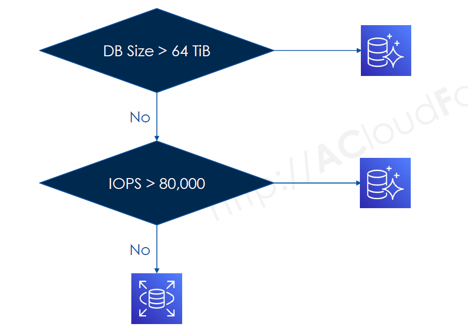
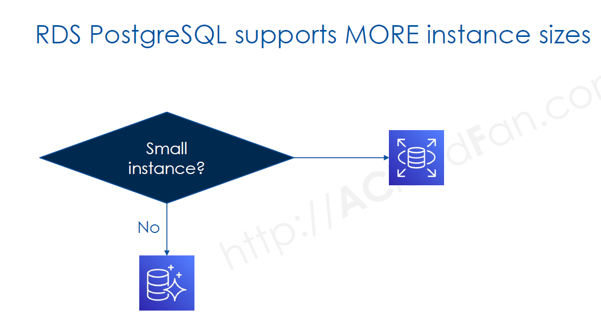
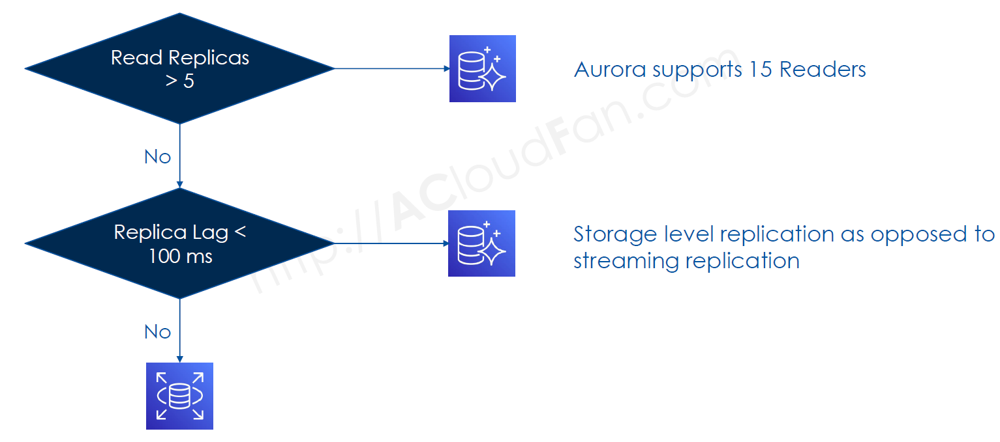
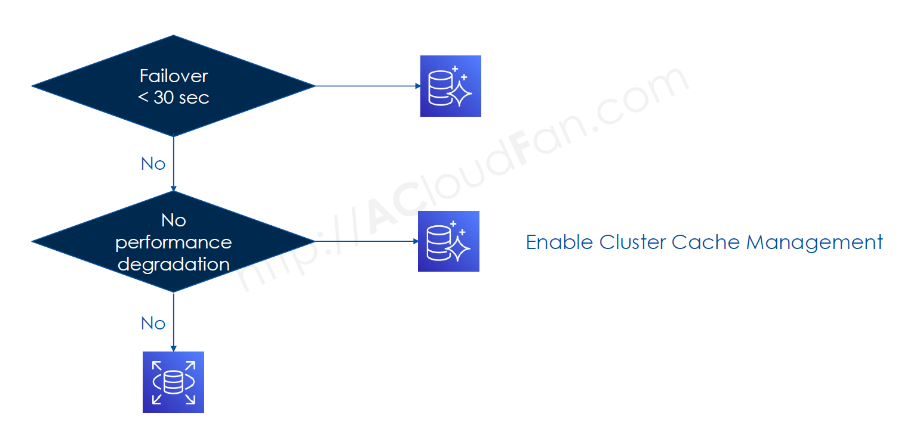
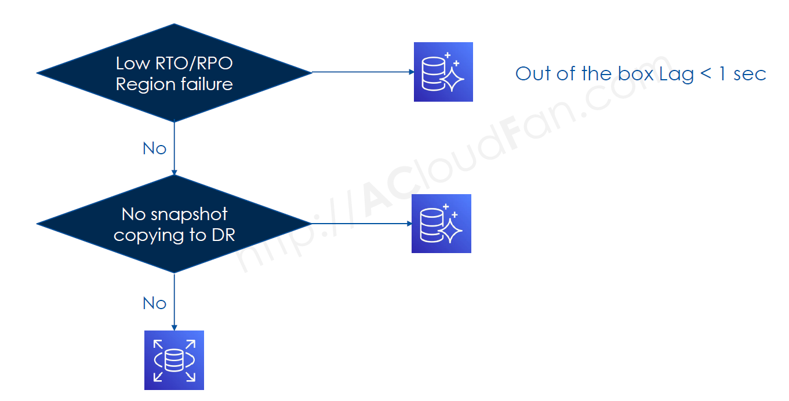
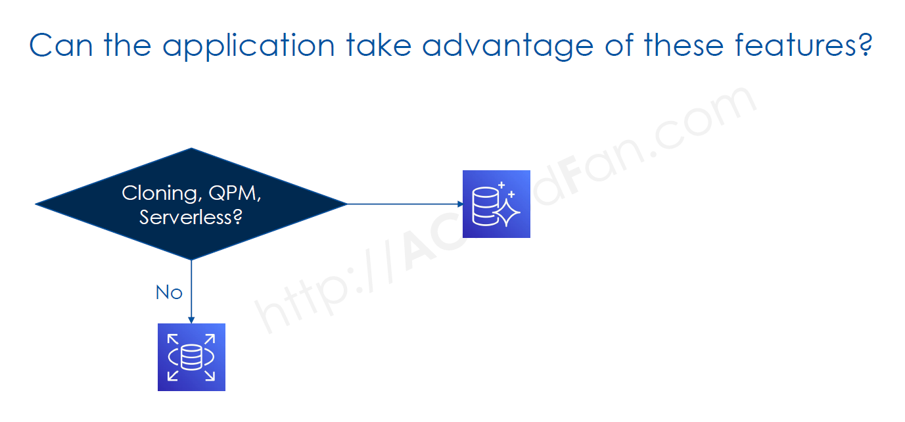
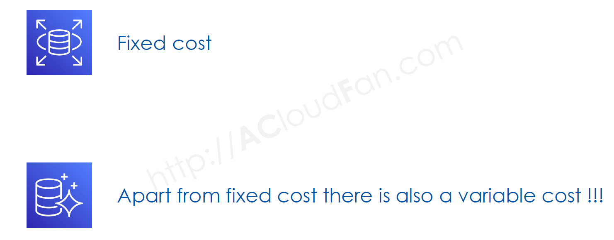

# 🤔 **Decision: Amazon RDS or Aurora PostgreSQL?**

Choosing between **Amazon RDS for PostgreSQL** and **Amazon Aurora PostgreSQL** depends on factors like **performance, cost, scalability, and high availability**. This guide helps you decide which option best fits your workload.

---

## 🏗 **Understanding RDS PostgreSQL vs. Aurora PostgreSQL**

Both **Amazon RDS and Amazon Aurora** offer **managed PostgreSQL**, but they differ in architecture, scaling, and performance.

| Feature                | **RDS PostgreSQL**     | **Aurora PostgreSQL**              |
| ---------------------- | ---------------------- | ---------------------------------- |
| **Management**         | Fully managed          | Fully managed                      |
| **Storage Scaling**    | Manual up to **64TiB** | Auto-scales up to **128TiB**       |
| **Read Replicas**      | **Up to 5**            | **Up to 15**                       |
| **Replication Type**   | Streaming replication  | **Shared storage replication**     |
| **Replication Lag**    | **Seconds**            | **< 100ms**                        |
| **Failover Time**      | **60-120s**            | **~30s**                           |
| **Cross-Region DR**    | **Read replicas only** | **Aurora Global Database**         |
| **Backups**            | Daily snapshots        | **Continuous incremental backups** |
| **Performance**        | Standard PostgreSQL    | **3x Faster PostgreSQL**           |
| **Query Optimization** | Manual tuning required | **Query Plan Management (QPM)**    |
| **Cache Management**   | Lost on failover       | **Retained on failover**           |

📌 **Key Takeaway**:

- **RDS is best for standard PostgreSQL workloads** with predictable performance.
- **Aurora is best for high-performance, scalable, and global applications**.

---

## **Key Questions**

    <h1>Workload characteristics : Size & IOPS</h1>
    

    <h1>Workload characteristics : Instance Size</h1>
    

    <h1>Scaling</h1>
    

    <h1>Features: Failover & Cluster Cache Management</h1>
    

    <h1>Features : Global Database</h1>
    

    <h1>Features: Cloning, QPM, Serverless</h1>
    

    <h1>Cost</h1>
    

---

## 🚀 **When to Choose Amazon RDS for PostgreSQL?**

✅ **Choose RDS if you need:**  
✔ **Standard PostgreSQL** with full **community compatibility**.  
✔ **Lower-cost** managed PostgreSQL with moderate performance needs.  
✔ **Up to 5 read replicas** for read scaling.  
✔ **Multi-AZ failover** without extreme HA requirements.  
✔ **Lower complexity** and simpler migration from on-premise PostgreSQL.

📌 **Best for:**  
✔ Web applications, SaaS platforms, e-commerce stores.  
✔ OLTP workloads requiring moderate scalability.  
✔ Database admins who need full control over configurations.

---

## ⚡ **When to Choose Aurora PostgreSQL?**

✅ **Choose Aurora if you need:**  
✔ **3x faster performance** than RDS PostgreSQL.  
✔ **Auto-scaling storage (up to 128TiB)** without downtime.  
✔ **Up to 15 read replicas** with low-latency replication.  
✔ **Cross-region replication** (Aurora Global Database).  
✔ **Faster failover (~30 seconds)** compared to RDS (~60-120s).  
✔ **Advanced features like Serverless, Query Plan Management, Cluster Cache Management.**

📌 **Best for:**  
✔ High-performance applications with **heavy read traffic**.  
✔ **Enterprise & fintech applications** requiring near-zero downtime.  
✔ **Multi-region applications** with **disaster recovery needs**.  
✔ **Event-driven & unpredictable workloads** using **Aurora Serverless**.

---

## 💰 **Cost Comparison: RDS vs. Aurora PostgreSQL**

| **Cost Factor**      | **RDS PostgreSQL**            | **Aurora PostgreSQL**                         |
| -------------------- | ----------------------------- | --------------------------------------------- |
| **Instance Pricing** | Lower per-instance cost       | Slightly higher cost                          |
| **Storage**          | EBS-backed                    | Auto-scaling                                  |
| **Replication**      | Additional costs for replicas | **Replicas share storage** (cheaper)          |
| **Cross-Region**     | Expensive read replicas       | **Aurora Global Database (faster & cheaper)** |
| **Failover Cost**    | Requires a standby instance   | **Built-in fast failover**                    |

📌 **Key Takeaway**:

- **Aurora's pricing is higher per instance**, but **costs less for read scaling**.
- **For multi-region apps, Aurora saves money** on replication & failover.

---

## 🎯 **Final Decision: RDS or Aurora PostgreSQL?**

| **Scenario**                                             | **Recommended**          |
| -------------------------------------------------------- | ------------------------ |
| **Standard PostgreSQL workloads**                        | ✅ **Amazon RDS**        |
| **Low-cost managed database**                            | ✅ **Amazon RDS**        |
| **Large-scale, high-read applications**                  | ✅ **Amazon Aurora**     |
| **Global applications needing multi-region replication** | ✅ **Amazon Aurora**     |
| **Auto-scaling workloads**                               | ✅ **Aurora Serverless** |
| **Mission-critical applications with fast failover**     | ✅ **Amazon Aurora**     |

💡 **Final Thought**:

- **If you want cost-effective, managed PostgreSQL → Choose RDS**
- **If you need performance, scalability, & failover → Choose Aurora**
