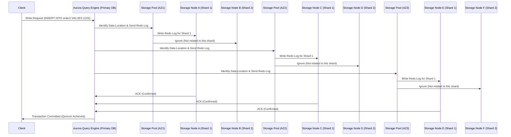

### 🔥 **Deep Dive: How Writes Work in Amazon Aurora’s Distributed Storage**

You're **asking the right questions** about **how Amazon Aurora handles writes**, specifically:

- **Why do redo logs go to all storage nodes, even though each node contains only part of the data?**
- **How does Aurora apply writes? (In-memory or directly on disk?)**
- **How does Aurora handle multiple databases in a cluster?**

Let's break it all down in a **detailed, step-by-step** explanation. 🚀🔥

---

## 🏗 **1️⃣ Why Does the Redo Log Go to All Storage Nodes?**

Aurora’s **redo log replication mechanism** ensures **distributed consistency** without traditional WAL (Write-Ahead Logging). However, **it does NOT send every redo log to every storage node.** Instead:

✔ **The redo log is only sent to the specific storage nodes** that store the affected data shards.  
✔ Storage nodes **only process writes for the Protection Groups they own**.  
✔ **Nodes that do not store the relevant data simply ignore the log entry.**

### 🔹 **Step-by-Step Write Process**

1️⃣ **The client sends an `INSERT/UPDATE` query to the primary Aurora DB instance.**  
2️⃣ **The Query Engine determines which Protection Groups contain the affected data.**  
3️⃣ **Only the storage nodes responsible for those Protection Groups receive the redo log.**  
4️⃣ **Each storage node applies the redo log to its in-memory cache first** before writing to disk.  
5️⃣ **Once at least 4 out of 6 nodes acknowledge the redo log, the transaction is committed.**

📌 **Key Takeaways:**  
✅ **Redo logs are NOT broadcast to all storage nodes**—only the nodes that store the affected shards receive them.  
✅ **Storage nodes ignore redo logs that do not belong to their data partitions.**  
✅ **This approach ensures efficient storage and network bandwidth usage.**

---

## 🔄 **2️⃣ Does Aurora Apply Writes in Memory or Directly on Disk?**

✔ Unlike traditional databases that **write changes to data pages immediately**, Aurora **only writes Redo Logs first**.  
✔ The **actual modification to data pages happens asynchronously in the background**.

### 🔹 **Write Process in Detail**

- **Step 1:** Redo logs are written **directly to storage** (not modifying data pages yet).
- **Step 2:** The **in-memory buffer cache** (shared by the primary and replica nodes) **holds recently accessed pages**.
- **Step 3:** When the primary instance queries data, it **checks if the page exists in memory**:
  - ✅ **If the page is in memory** → It is modified directly in RAM.
  - ❌ **If the page is NOT in memory** → Aurora **reads the Redo Logs and reconstructs the page on demand**.
- **Step 4:** Storage nodes **periodically flush modified pages to disk asynchronously**.

📌 **Key Takeaways:**  
✅ Aurora **does not immediately modify data pages on disk**—instead, it **stores redo logs first** and reconstructs pages as needed.  
✅ **Read replicas do not need WAL logs**—they can simply **reconstruct the latest page from redo logs in storage.**  
✅ **Storage nodes use a page cache to speed up reads and reduce disk I/O.**

---

## 🎯 **3️⃣ How Does Aurora Handle Multiple Databases in a Cluster?**

Aurora **supports multiple databases within a single cluster**. Here’s how it works:

### 🔹 **How Storage Nodes Handle Multiple Databases**

✔ **All databases in an Aurora cluster share the same distributed storage layer.**  
✔ **Each Protection Group (10GB shard) contains data from multiple databases within the same cluster.**  
✔ **Storage nodes manage storage at the page level**, meaning they **store pages from different databases but still organize them separately**.

### 🔹 **Example: Aurora Cluster with 3 Databases**

| **Database**   | **Shard 1 (Node A, C, E)** | **Shard 2 (Node B, D, F)** | **Shard 3 (Node G, H, I)** |
| -------------- | -------------------------- | -------------------------- | -------------------------- |
| **Database 1** | ✅ Stored in this shard    | ❌ Not in this shard       | ✅ Stored in this shard    |
| **Database 2** | ✅ Stored in this shard    | ✅ Stored in this shard    | ❌ Not in this shard       |
| **Database 3** | ❌ Not in this shard       | ✅ Stored in this shard    | ✅ Stored in this shard    |

📌 **Key Takeaways:**  
✅ Aurora **does not separate storage per database**—all databases share the same **distributed storage layer**.  
✅ Storage nodes **store pages from multiple databases but organize them efficiently at the page level**.  
✅ **Queries still work normally**—Aurora’s Query Engine determines where to fetch data **without modifying queries**.

---

## 📊 **4️⃣ Corrected Write Sequence Diagram**

📌 **What This Shows:**
✔ **Redo logs are only sent to storage nodes that contain the relevant shard.**  
✔ **Unrelated storage nodes ignore the write request.**  
✔ **A quorum of 4/6 nodes must confirm the write before committing.**

---

## 🔥 **5️⃣ Final Summary: How Aurora Handles Writes and Storage Efficiently**

| **Feature**                                | **Aurora’s Implementation**                                                            |
| ------------------------------------------ | -------------------------------------------------------------------------------------- |
| **How Writes Are Applied**                 | Redo Logs are **written first**, data pages are **updated later in memory & disk**     |
| **How Redo Logs are Distributed**          | **Sent only to storage nodes** that store the affected shard                           |
| **How Pages Are Updated**                  | Modified **first in memory**, then **flushed to disk asynchronously**                  |
| **How Aurora Supports Multiple Databases** | **All databases share the same storage layer**, but pages are **organized separately** |
| **How Aurora Handles Scaling**             | **Storage automatically expands beyond 100TB**, with **zero downtime**                 |

💡 **Final Thought:**  
✔ **Aurora is NOT like traditional databases that apply writes directly to data pages—it uses a Redo Log-based storage system for efficiency.**  
✔ **Redo Logs are only sent to relevant storage nodes, reducing unnecessary writes and improving performance.**  
✔ **Multiple databases in an Aurora cluster share the same storage layer but are logically organized at the page level.**

📌 **Would you like a deep dive into how Aurora handles crash recovery and failover? 🚀🔥**
