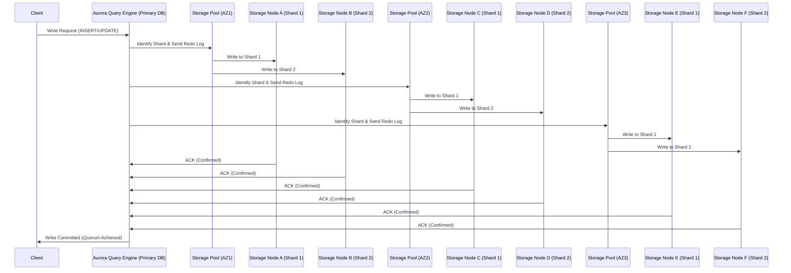
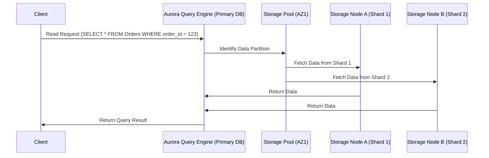

# 🏗 **Amazon Aurora Storage Nodes – Behind the Scenes**

Amazon Aurora's storage architecture is one of the **biggest innovations** in cloud-based relational databases. Unlike traditional RDBMS architectures that store all data in a **single monolithic storage volume**, Aurora uses a **distributed, fault-tolerant, and auto-scaling storage system**.

This document covers **everything you need to know** about Aurora's storage internals, including:
- **How Aurora distributes data** across storage nodes
- **How it ensures durability, consistency, and fault tolerance**
- **How storage nodes communicate and sync data**
- **How Aurora scales beyond 100TB without downtime**
- **How Aurora handles read and write operations efficiently**

Let's dive in! 🚀🔥

---

## 📂 **1. Aurora Storage Layer: High-Level Overview**
### 🔍 **How is Aurora Storage Different from Traditional RDBMS?**
Unlike traditional databases that store data in a **single disk or volume (e.g., EBS in RDS)**, Aurora breaks the database into **smaller storage segments (Protection Groups)** and spreads them across **multiple storage nodes in different Availability Zones (AZs)**.

### ⚙️ **Core Features of Aurora’s Storage Layer**
- **📦 Auto-Scalable Storage:** Aurora automatically expands storage from **10GB to 128TB** without downtime.
- **🌍 Distributed Storage:** The database is **split into 10GB chunks** (Protection Groups) and stored across multiple storage nodes.
- **🏆 Fault-Tolerant:** Each 10GB chunk is **replicated six times** across **three AZs**.
- **🌎 Globally Distributed:** With Aurora Global Database, data can be **replicated across AWS regions**.

### 🏢 **How Aurora Storage Nodes Are Structured**
Aurora’s **storage nodes** consist of:
- **✅ Storage Nodes (EC2 Instances):** Compute units responsible for managing storage blocks.
- **🛡 Protection Groups:** 10GB data chunks distributed across multiple nodes.
- **💰 Redo Log Storage:** Instead of modifying data pages immediately, Aurora **writes redo logs first**, which are then applied to storage nodes.
- **📡 Peer-to-Peer Gossip Protocol:** Storage nodes synchronize updates without a central coordinator.
- **🏛 Quorum-Based Writes:** A write is confirmed only if **4 out of 6 storage nodes** acknowledge the change.

---

## 🔄 **2. How Aurora Distributes Data Across Storage Nodes**
### 🔍 **What is Data Distribution in Aurora?**
Aurora **does not store the entire database in a single location**. Instead:
- The database is **split into 10GB chunks (Protection Groups)**.
- These chunks are **spread across multiple storage nodes in different AZs**.
- **Each storage node stores only part of the database (not the full database).**

### ⚙️ **Corrected Example: How Aurora Stores a 50GB Database**
| **Shard (Protection Group)** | **Storage Node in AZ1** | **Storage Node in AZ2** | **Storage Node in AZ3** |
|-----------------|----------------|----------------|----------------|
| **Shard 1 (10GB)** | Node A | Node C | Node E |
| **Shard 2 (10GB)** | Node B | Node D | Node F |
| **Shard 3 (10GB)** | Node G | Node H | Node I |
| **Shard 4 (10GB)** | Node J | Node K | Node L |
| **Shard 5 (10GB)** | Node M | Node N | Node O |

### 💡 **Key Takeaways:**
- **Each storage node stores only a subset of the database.**
- **Chunks are evenly distributed across three AZs to ensure durability.**
- **If a node fails, data is reconstructed from the remaining nodes.**

---

## 🔄 **3. How Aurora Handles Reads and Writes in a Distributed System**
### **✍️ Write Operation Sequence Diagram**

---

### **📖 Read Operation Sequence Diagram**

---

## 🎯 **Conclusion: Why Aurora’s Storage Architecture is Revolutionary**
- **Aurora automatically distributes data into 10GB chunks.**
- **Storage nodes handle only a portion of the database.**
- **Queries are executed in parallel across storage nodes for performance.**
- **Writes use Quorum-based commits to ensure durability.**

💡 **Final Thought:** Aurora's storage model **eliminates replication lag, enables instant failover, and scales effortlessly** beyond traditional RDBMS architectures.

🚀 **Would you like a deep dive into how Aurora handles crash recovery and self-healing? Let me know!**

